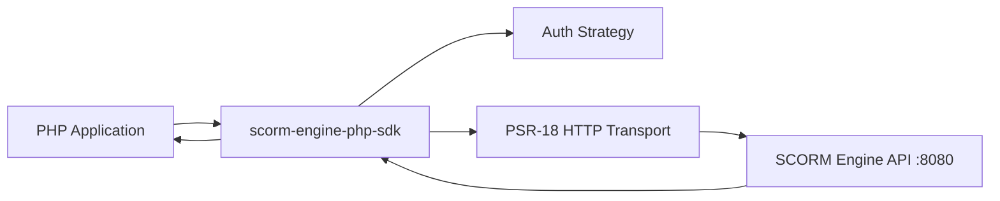
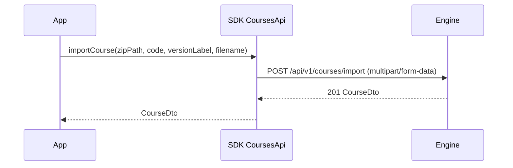

# scorm-engine-php-sdk

## Scope
Framework-agnostic PHP SDK for `scorm-engine` REST API (`/api/v1`):
- typed API wrappers (`courses`, `users`, `enrollments`, `launches`, `attempts`)
- auth strategy support (engine token / launch token)
- DTO mapping and standardized exception mapping
- multipart upload support for course import

## Runtime
- Server port: `N/A` (library package, no HTTP server)
- Target engine base URL (default usage): `http://localhost:8080/api/v1`

## Architecture


## Request Flow (Course Import)


## API Coverage
- Courses: import/list/get
- Users: create/list/get
- Enrollments: create/list
- Launches: create/context/terminate
- Attempts: list/progress

## Multipart Import API
```php
importCourse(
    string $zipPath,
    ?string $code = null,
    ?string $versionLabel = null,
    ?string $filename = null
)
```

- `zipPath`: filesystem path for bytes to upload.
- `filename`: original client filename sent in multipart `Content-Disposition`.
- Use `filename` when framework temp upload paths do not keep `.zip` extension.

## Error Mapping
Non-2xx responses are mapped to:
- `ValidationException` (`400/422`)
- `UnauthorizedException` (`401/403`)
- `NotFoundException` (`404`)
- `ConflictException` (`409`)
- `UnexpectedResponseException` (other)

## Build/Test
```bash
composer install
composer test
```

## Transport Middleware Configuration
`ScormEngineClientFactory` configures transport middleware from `Configuration`.

Available options:
- `enableRetry` (default `true`)
- `retryMaxAttempts` (default `3`)
- `retryDelayMs` (default `0`)
- `retryableStatusCodes` (default `[502, 503, 504]`)
- `retryableMethods` (default `['GET']`)
- `enableTransportLogging` (default `true`)

Example:
```php
$configuration = new Configuration(
    baseUrl: 'http://localhost:8080/api/v1',
    enableRetry: true,
    retryMaxAttempts: 4,
    retryDelayMs: 100,
    retryableStatusCodes: [502, 503, 504],
    retryableMethods: ['GET'],
    enableTransportLogging: true
);
```
